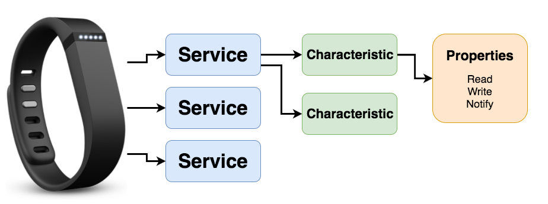
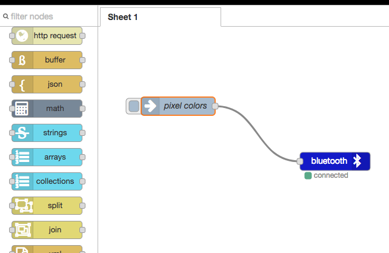
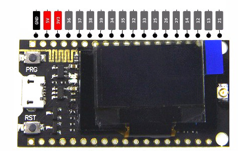

# IoT DevFest 2018


## What is Bluetooth Low Energy?




## Web Bluetooth




[https://chirpers.com](https://chirpers.com/browser)


## ESP32 + LoRa


This firmware for today:  https://github.com/monteslu/iotdevfest18/blob/master/iotdevfest_lora/iotdevfest_lora.ino


## Badge Assembly



* remove paper from acrylic
* attach batter holder
* addatch esp32 board & connect power
* solder neopixel strip
* attach neopixels


## Sending Bytes.


Our main service Id for the badge: `6e400001-b5a3-f393-e0a9-e50e24dcca9e`

### characteristics

* lora relay Characteristic `6e400002-b5a3-f393-e0a9-e50e24dcca9e`

* configure screen `bada5566-e91d-1337-a49b-8675309fb070`
  * `[1, 16, 0, 0]`
  * first byte = 1 to clear screen, 0 to leave as is
  * second byte = font size 10, 16, or 24
  * third byte = draw position X
  * fourth byte = draw position Y

* write characters to screen `bada5566-e91b-1337-a49b-8675309fb070`

* write characters , but clear first `bada5566-e91c-1337-a49b-8675309fb070`

* Neopixels on pin 12 `bada5566-e91a-1337-a49b-8675309fb070`
  * [255,0,0, 127,127,0, 0,0,50]
  * 9 bytes.  for RGB values for each of the 3 neopixels


## last resort...

If you're having trouble getting things going, you can import this flow into chirpers:

```javascript
[{"id":"3axTBralbX4","type":"chirpers in","z":"mDRMOWxAyVw","name":"lora broadcasts","directToMe":false,"device":"f4a2b572-b33f-495d-a8f1-7271815d40a4","x":141,"y":528,"wires":[["9f9-S1MBSMk"]]},{"id":"9f9-S1MBSMk","type":"debug","z":"mDRMOWxAyVw","name":"","active":true,"console":"false","complete":"false","x":375,"y":621,"wires":[]},{"id":"sYIll5kSUSA","type":"inject","z":"mDRMOWxAyVw","name":"pixel colors","topic":"","payload":"[255,0,0, 127,127,0, 0,0,50]","payloadType":"json","repeat":"","crontab":"","once":false,"allowDebugInput":false,"x":132,"y":131,"wires":[["0Cc9ZaGo68g"]]},{"id":"0Cc9ZaGo68g","type":"bluetooth out","z":"mDRMOWxAyVw","name":"pixel control","deviceName":"","characteristicId":"bada5566-e91a-1337-a49b-8675309fb070","bleServiceId":"6e400001-b5a3-f393-e0a9-e50e24dcca9e","x":391,"y":222,"wires":[]},{"id":"WD9X88cx0Rc","type":"bluetooth out","z":"mDRMOWxAyVw","name":"lora out","deviceName":"","characteristicId":"6e400002-b5a3-f393-e0a9-e50e24dcca9e","bleServiceId":"6e400001-b5a3-f393-e0a9-e50e24dcca9e","x":403,"y":336,"wires":[]},{"id":"AkeuaLWbJww","type":"inject","z":"mDRMOWxAyVw","name":"","topic":"","payload":"hello world","payloadType":"str","repeat":"","crontab":"","once":false,"allowDebugInput":false,"x":145,"y":305,"wires":[["WD9X88cx0Rc"]]},{"id":"jFBmsuh9twQ","type":"bluetooth out","z":"mDRMOWxAyVw","name":"write to screen","deviceName":"","characteristicId":"6e400002-b5a3-f393-e0a9-e50e24dcca9e","bleServiceId":"6e400001-b5a3-f393-e0a9-e50e24dcca9e","x":418,"y":456,"wires":[]},{"id":"uVpz6mdsjzw","type":"inject","z":"mDRMOWxAyVw","name":"","topic":"","payload":"I love this badge!","payloadType":"str","repeat":"","crontab":"","once":false,"allowDebugInput":false,"x":124,"y":435,"wires":[["jFBmsuh9twQ"]]}]
```
